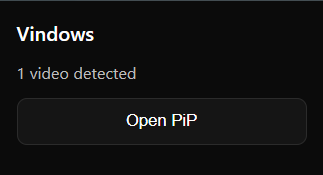
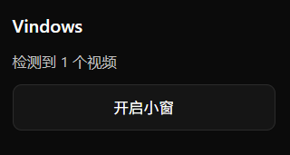

# Vindows

一个轻量、实用的浏览器扩展：自动检测网页视频并一键以小窗（画中画，Picture‑in‑Picture, PiP）播放。支持多语言、快捷键、动态检测等能力，让你在浏览任意网页时随时把视频“抠出来”悬浮播放。

## Screenshots

|英文(美)|简体中文|
|--|--|
|||

## 主要功能

- 自动检测当前页面视频元素（包含直播、长短视频等常见播放器）
- 一键开启小窗（PiP）播放
- 浏览器图标指示当前页面是否检测到视频，数量徽标提示
- 快捷键开启（默认建议：Alt+Shift+V，可在扩展快捷键中自定义）
- 页面状态变化时自动重新检测（切换标签页、窗口聚焦、DOM 变化等）
- 多语言界面：中文、英文（美/英）、俄语、印地语、日语

## 使用说明

1. 安装并固定扩展图标到工具栏。
2. 当图标为彩色时表示检测到视频，点击弹窗中的“开启小窗”即可进入 PiP。
3. 也可使用快捷键（建议 Alt+Shift+V）。若与系统/浏览器冲突，请在 `chrome://extensions/shortcuts` 中自定义。
4. 关闭 PiP 或切换标签页后，扩展会自动重新检测状态。

提示：某些网站或视频因策略限制（如 `disablePictureInPicture`、DRM、内嵌 PDF、`chrome://` 页面等）不支持 PiP，此时会显示失败提示，无法强制开启。

## 权限说明

- tabs / activeTab：获取当前活动标签页以发送指令（PiP、状态刷新）
- scripting：向页面注入用于检测视频与执行 PiP 的内容脚本
- notifications：在无法开启小窗或未检测到视频时显示通知
- host_permissions：`<all_urls>` 用于在大多数网页上运行检测逻辑

我们仅在本地完成视频检测与操作，不会收集或上传任何个人数据。详见下方《隐私政策》。

## 快捷键

- 默认建议：Alt+Shift+V（可在 `chrome://extensions/shortcuts` 自定义）
- 如遇系统占用（例如输入法切换的 Alt+Shift），可改用 Alt+Shift+P / O / X 等组合。

## 多语言 (i18n)

扩展会根据浏览器语言自动匹配：

- 简体中文（zh_CN）
- 繁体中文 (zh_TW)
- English (US)
- English (UK)
- Русский (ru)
- हिन्दी (hi)
- 日本語 (ja)

## 常见问题

- “按钮能开，快捷键没反应”：请在快捷键页面重新设置一个未被占用的组合，并确保浏览器与标签页已激活聚焦。
- “提示需要用户手势”：先点击页面或操作播放器后再尝试开启 PiP。
- “某些站点始终失败”：可能由站点策略或 DRM 限制，无法绕过。

## 支持与反馈

如需新功能或遇到问题，欢迎在扩展商店页面反馈，或提交 Issue（若开源仓库可见）。
